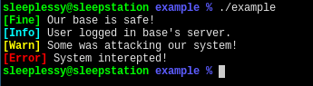

# Colorful Logger Presets

[](https://travis-ci.org/Sleeplessy/pony-colorfylog)

pony-colorfylog provides a helper class to help people put colorfied texts to console.

## How to use?

Just clone this repo as a package.

```bash
git clone git@github.com:Sleeplessy/pony-colorfylog.git colorfylog
```

## Example


```Pony
use "logger"
use "colorfylog"


actor Main
  new create(env: Env) =>
    let logger = ColorLogger(Fine, env.out)
    logger.log("Our base is safe!", Fine)
    logger.log("User logged in base's server.", Info)
    logger.log("Some was attacking our system!", Warn)
    logger.log("System interepted!", Error)
```

### Preview




# LICENSE

Codes was released under BSD 2-Clause License.
Whatever you do, please check for the LICENSE file.(Well, I guess nobody would TAKE IT A LOOK)
